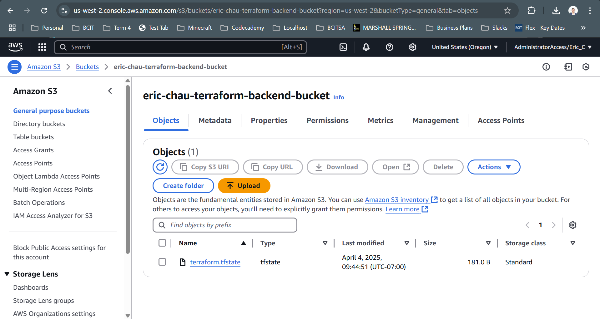
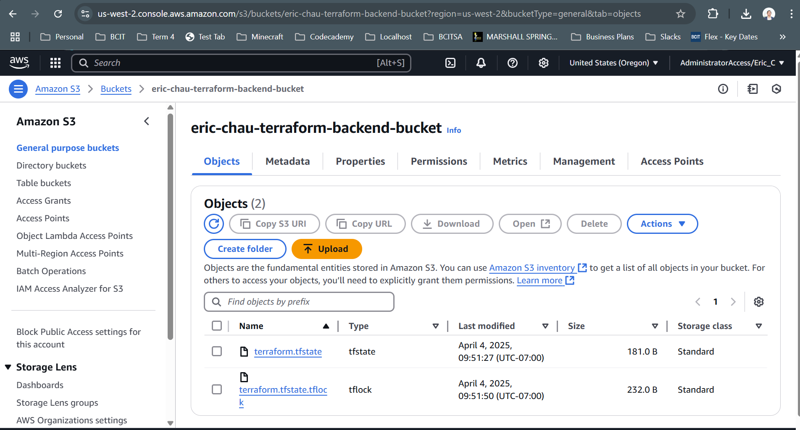

# 4640-w13-lab-start-w25

### When is the state file created?

State file is created when apply is initiated

### When is the lock file present?

Lock file was present when apply is ran but before yes.

### Is the lock file always in the bucket after it is created?

No, the lock file disappears when the resources is not in use.

